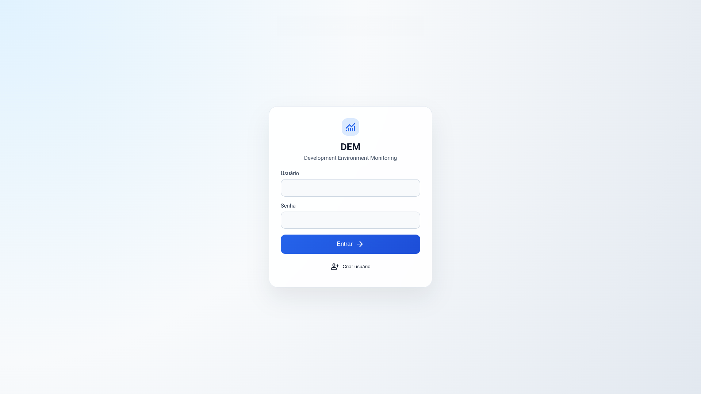
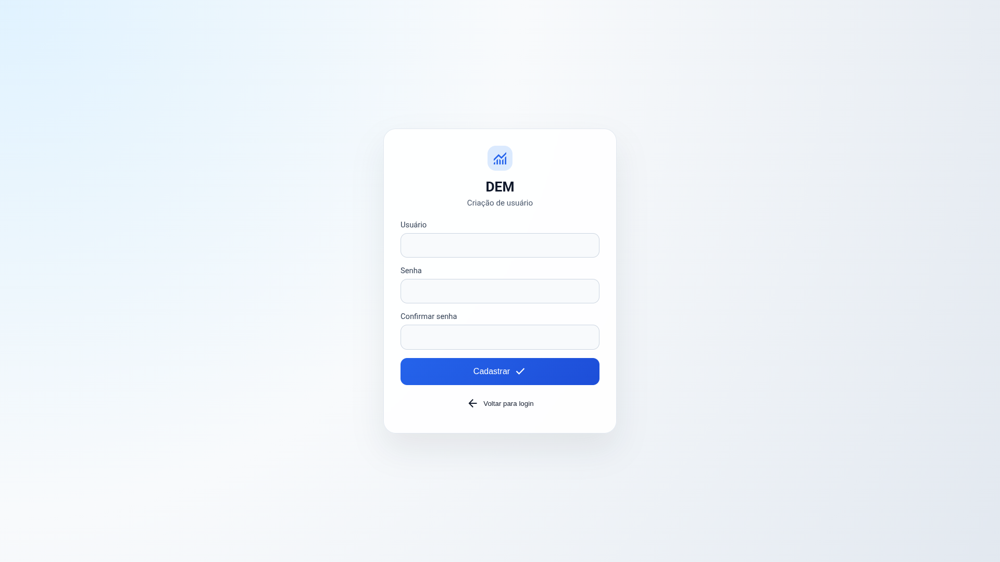
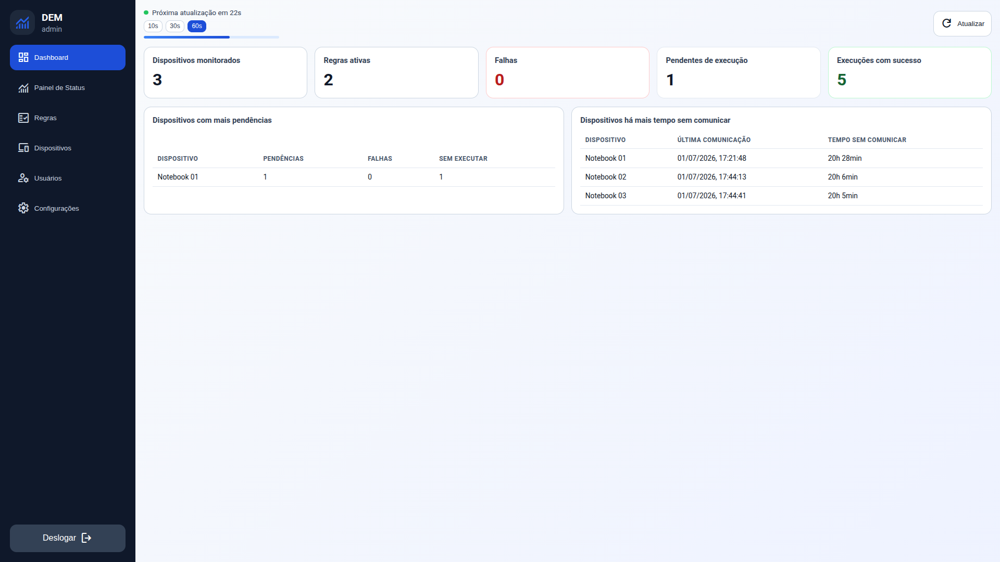
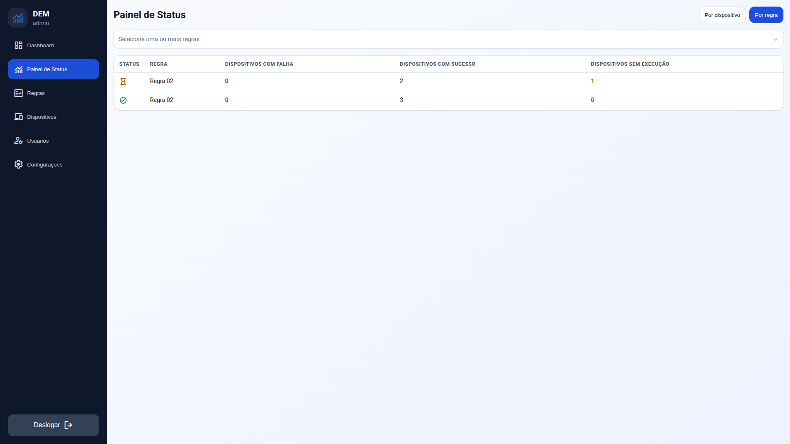
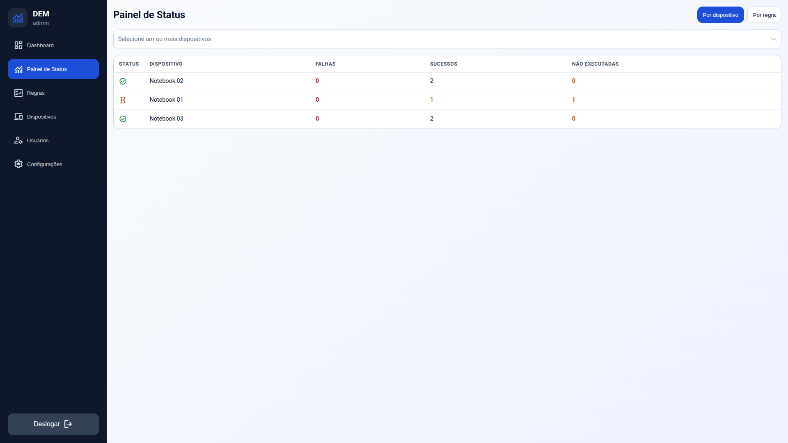
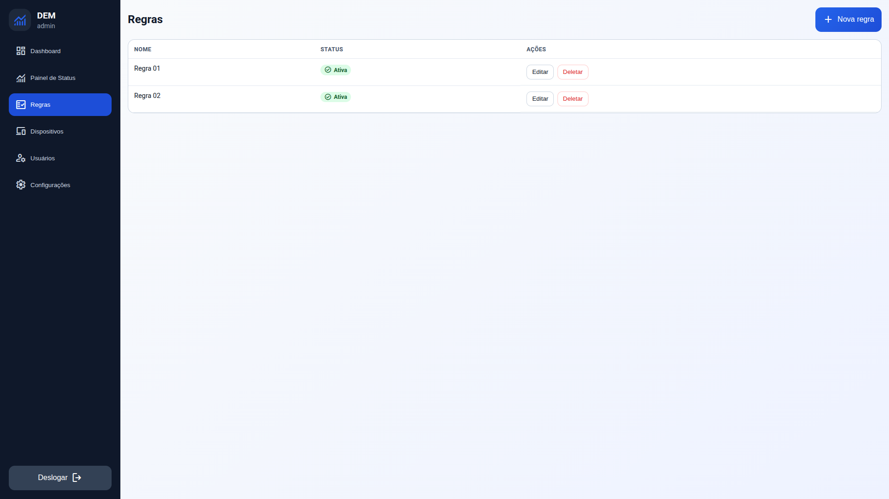
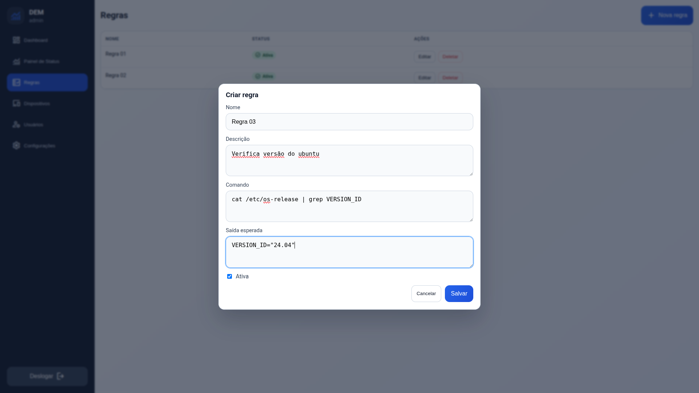
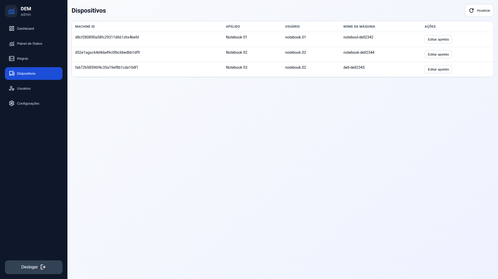
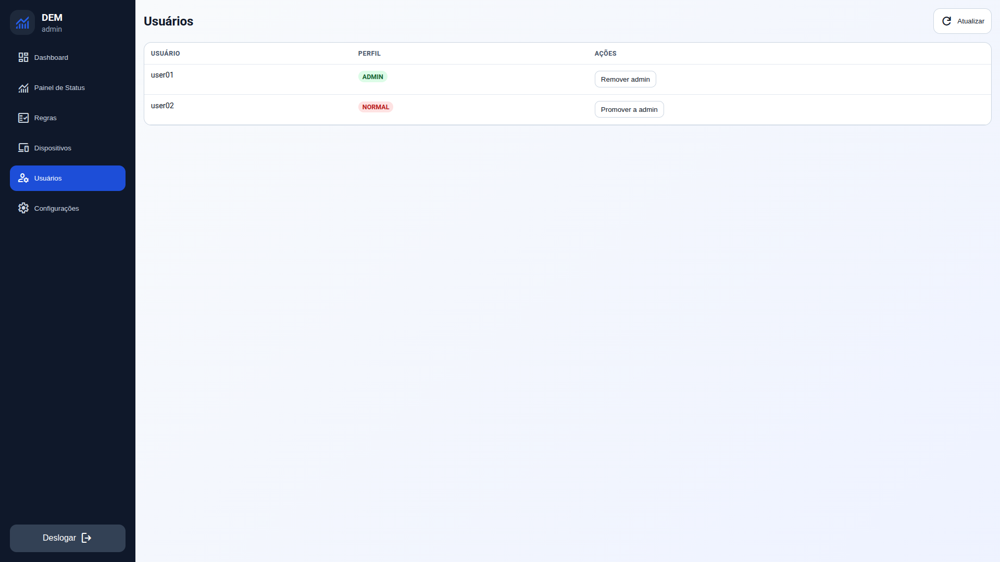

# O que é o DEM

## Definição

DEM (Development Environment Monitoring) é uma solução para monitorar a conformidade técnica de ambientes de desenvolvimento.

Em vez de observar apenas a disponibilidade de serviços, o DEM verifica se cada máquina está seguindo regras operacionais definidas pelo time, por exemplo:

- ferramenta instalada em versão mínima;
- comando obrigatório retornando a saída esperada;
- padrão técnico exigido para produtividade e segurança.

## Problema que o DEM resolve

Times técnicos costumam enfrentar variações entre ambientes de desenvolvimento:

- em uma máquina funciona, em outra não;
- onboarding inconsistente;
- perda de tempo com erros repetitivos de configuração;
- baixa visibilidade sobre quem está fora do padrão.

O DEM reduz esse gap ao transformar regras técnicas em verificações automatizadas e centralizadas.

## Para quem é o DEM

O DEM é pensado para equipes que precisam de governança técnica sem perder agilidade.

- Liderança técnica (Tech Leads, Staff, Arquitetura): define e evolui padrões.
- Equipe de plataforma/DevEx: monitora a aderência e remove a fricção do ambiente.
- Times de desenvolvimento: recebem feedback objetivo sobre a conformidade local.
- Operação interna/segurança: ganha trilha histórica para auditoria técnica.

## Como funciona no dia a dia

1. Um administrador cadastra regras no painel.
2. O cliente DEM executa as regras na máquina local.
3. O cliente envia o resultado (success/error) e a saída para o backend.
4. O dashboard consolida status por usuário, dispositivo e regra.
5. A equipe prioriza correções com base em pendências reais.

## Telas do sistema

### Acesso e onboarding

Tela de login:

Tela de criação de conta:

### Monitoramento e status

Dashboard:

Painel de status por regra:

Painel de status por dispositivo:

### Governança operacional

Lista de regras:

Criação/edição de regra:

Lista de dispositivos:

Gestão de usuários:

## Diferenciais do DEM neste projeto

- Foco em conformidade técnica, não apenas em disponibilidade de infraestrutura.
- Coleta distribuída (execução local), evitando suposições do servidor.
- Histórico de resultados append-only para rastreabilidade.
- Visão de ação com ranking de pendências e usuários sem comunicação recente.
- Identificação amigável de dispositivos por alias.
- Controle de acesso por perfil (ADMIN e NORMAL).

## O que o DEM não substitui

O DEM não substitui ferramentas clássicas de observabilidade de produção.
Ele complementa esse ecossistema ao cobrir uma camada diferente: qualidade e padronização do ambiente de desenvolvimento.

## Quando adotar

O DEM tende a gerar mais valor quando:

- existe mais de um time/produto compartilhando padrões;
- o onboarding está lento ou inconsistente;
- há recorrência de incidentes por divergência de ambiente local;
- a equipe quer reduzir o troubleshooting repetitivo.